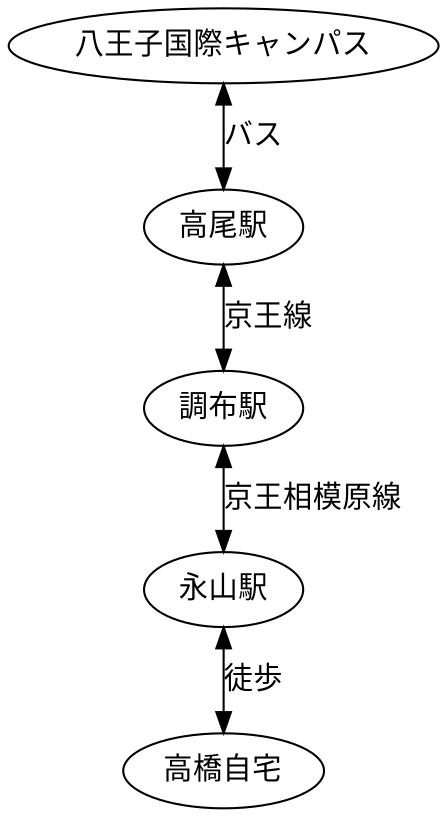

# 高橋の通学経路

[メンバー表に戻る](member.md#メンバー表)

```graphviz
digraph {
    edge [dir=both]

    八王子国際キャンパス -> 高尾駅 [label=バス]
    高尾駅 -> 調布駅 [label=京王線]
    調布駅 -> 永山駅 [label=京王相模原線]
    永山駅 -> 高橋自宅 [label=徒歩]
}
```
